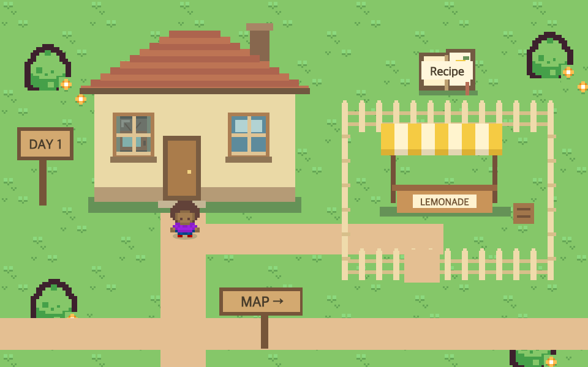
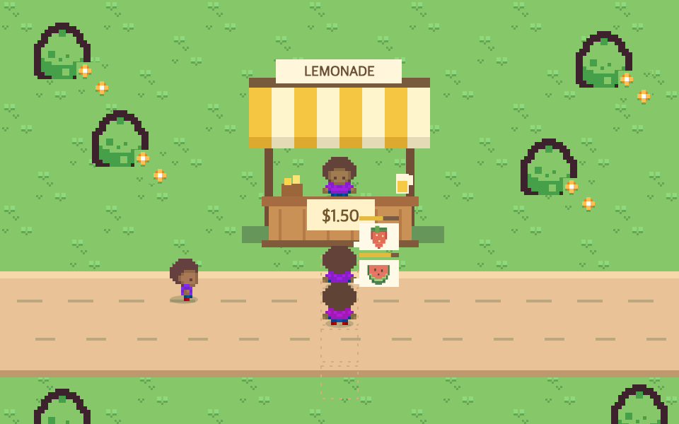
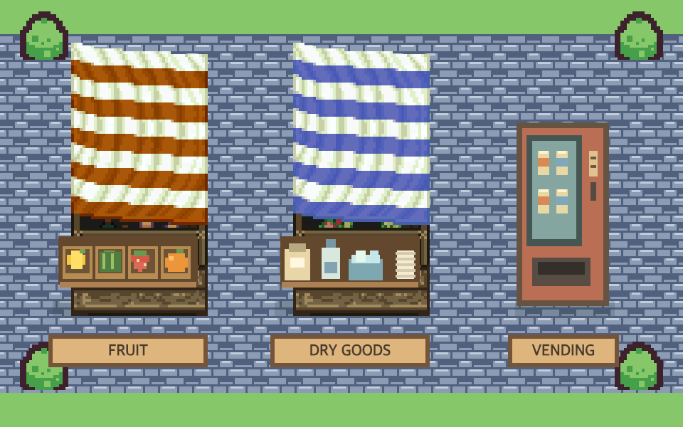
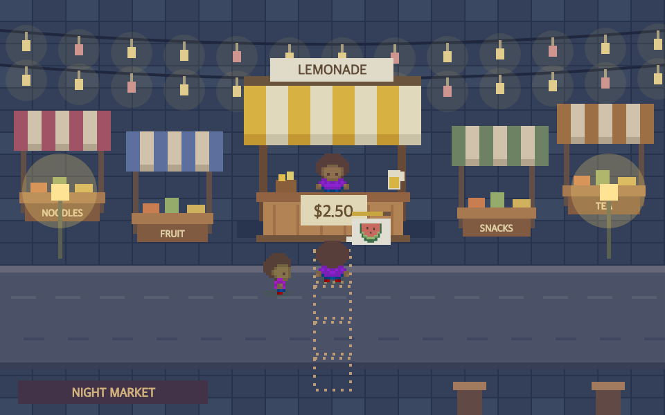

# Web Mini Games

A browser arcade for discovering and playing small games. The first playable title, **Lemonade Stand**, turns a command-line lab idea into an interactive 2D business simulation with pixel art, moving customers, and drinks made to order.

**[Explore the arcade](https://qetuop-mini-arcade.qetuop-games.workers.dev/)** · **[Play Lemonade Stand](https://qetuop-lemonade-stand.qetuop-games.workers.dev/)**

Play directly in your browser—no installation or account required.

## The experience

The arcade is a hub: choose a game, view its introduction and gameplay previews, then launch its independent website. Lemonade Stand is playable today; Snake and Memory Match are listed as coming soon.

In Lemonade Stand, you start with **$15**, ten each of cups, lemons, sugar, and ice, plus five strawberries and five watermelon portions. Buy supplies at the market, choose where to sell, set your price, and prepare each customer's drink before they lose patience.

- **Make drinks on demand.** Click ingredients to prepare classic lemonade, Pink Lemonade, or Watermelon Lemonade. Customer bubbles show fruit orders; serving the wrong drink wastes the cup and earns no payment.
- **Learn customer preferences.** Balance sourness, sweetness, and ice. Satisfied customers leave tips, while price and waiting time affect whether they buy.
- **Plan around the weather.** Check the forecast on your home television. Weather and temperature influence foot traffic and demand; rainy scenes include rain and some customers carrying umbrellas.
- **Grow across the town.** Start at Lemon Lane and unlock the park, commercial street, and night market. Commercial customers have larger budgets and less patience; the busier night market charges a $50 stall fee.
- **Manage the business.** Shop at fruit and dry goods stalls, track inventory, pause or close early, and review sales, tips, and profit at the end of the day.

## Gameplay previews

| Home & town planning | Preparing customer orders |
| --- | --- |
|  |  |

| Market | Night market |
| --- | --- |
|  |  |

## Engineering highlights

- **Independent portal and game.** The Next.js portal and standalone game deploy separately, with launch and return links connecting them.
- **A reusable game registry.** Shared metadata drives game cards and introduction routes, making it straightforward to add more titles.
- **Modular game rules.** Simulation, customer taste, weather, locations, market purchases, and drink matching live in separate JavaScript modules, apart from the UI and drawing code.
- **Canvas-based 2D presentation.** Pixel scenes, customer movement, weather effects, and ingredient interactions run in the browser.
- **Tested game mechanics.** Automated tests cover inventory and cash accounting, tips, wrong orders, customer timeouts, pausing, early closing, weather, and location-specific rules.
- **Static deployment.** Both websites run on Cloudflare Workers Static Assets. Gameplay runs locally in the browser without a backend or database.

## Technology

| Area | Stack |
| --- | --- |
| Arcade portal | Next.js App Router, React, TypeScript, Tailwind CSS |
| Lemonade Stand | JavaScript ES modules, HTML Canvas, CSS |
| Game tests | Node.js built-in test runner |
| Hosting | Cloudflare Workers Static Assets, Wrangler |

## Run locally

```sh
npm ci
npm run dev
```

Open the arcade at `http://localhost:3000`.

To run the standalone game:

```sh
python3 -m http.server 3001 --directory standalone/lemonade-stand
```

Open `http://localhost:3001`.

```sh
# Validate the portal and game rules
npm run lint
npm run typecheck
node --test standalone/lemonade-stand/*.test.mjs

# Build and publish the two websites independently
npx wrangler login
npm run deploy:arcade
npm run deploy:lemonade
```

Deployments are manual; pushing to GitHub alone does not publish a new version.

## Current scope & next steps

This project is in active development. Game progress currently lasts for the browser session; refreshing starts a new game. Snake and Memory Match are not playable yet, and the market vending machine is a placeholder for future functionality.

Next steps include persistent saves, more mini games, and expanded market items and town events.

## Asset credits

Third-party game assets retain their attribution and license files in [`standalone/lemonade-stand/assets`](standalone/lemonade-stand/assets). Preview credits are in [`public/previews/art-credits.txt`](public/previews/art-credits.txt), with market artwork licensing in [`public/previews/market-license.txt`](public/previews/market-license.txt).
